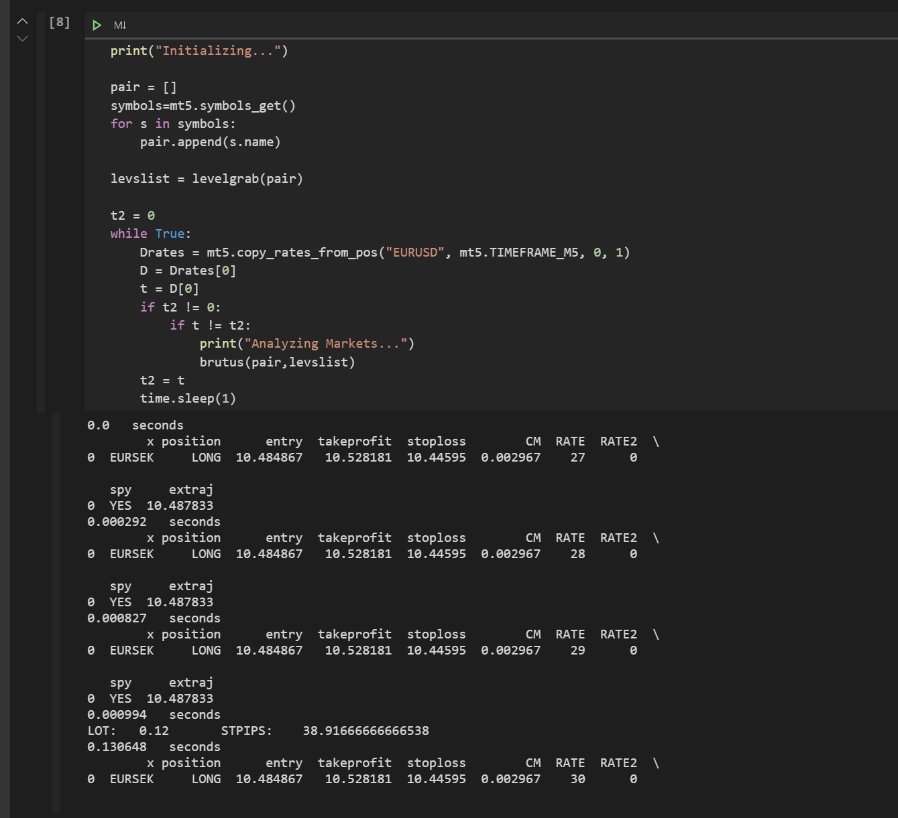
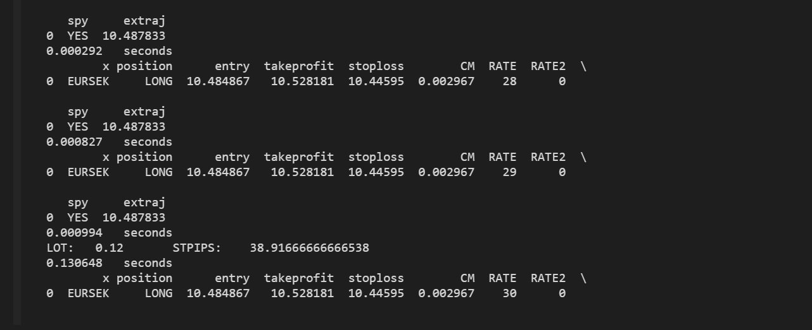

# Algorithm Trading

These Python scripts are designed to perform numerous calculations on financial market data from the MetaTrader API and place trades.

They query the API for raw price data, then calculate things like moving averages, relative strength index, and Bollinger bands. 

When a combination of a few particular metrics shows a well-known technical pattern which draws trading volume, the programs will actually place the trades automatically!

### Some Key Price Data Patterns/Metrics

```shell
Support & Resistance Levels
Exponential Moving Average (EMA)
Relative Strength Index (RSI)
Ichimoku Lines
Triangle Patterns
Candlestick Patterns:
    Head & Shoulders
    Double Top Reversal
    Triple Top Reversal
    Bullish/Bearish Continuations
```

### What They Look Like in Action

#### In Python




#### On the MetaTrader App (Mobile)
