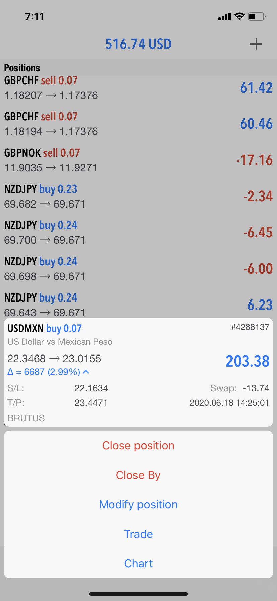

# Algorithm Trading

Each Python script is an algorithm-based trading bot. They are all designed to process price data and execute trades
based on recognized patterns.

Simply put, I took popular trusted strategies for technical analysis trading and wrote them into code.

---

### How it Works

Each program retrieves price data in bulk from the MetaTrader API. These algorithms focus primarily on currency pairings -
both national currencies and cryptocurrencies.

It applies various measurements to a particular currency pair's `high`, `low`, `open` and `close` price. 
These measurements are common technical analysis strategies practiced by traders all over the world. 

Typically, these strategies are drawn on charts using technology and visualized by the naked eye.
However, here we simply coded the math behind each of these graphical strategies.

Each measurement taken is associated with its relative value in relation to price. For example, we don't just
look at the Exponential Moving Average itself, but instead we take a look at how far away the current price is from
the Exponential Moving Average.

When a handful of measurements are determined by the program to be favorable all at once, a trade is then placed.
The bots know - based on their measurements - whether this trade should be a buy or sell!

---

**Take a look at some of the outputs in the pictures below to see the trades in action!**

---

### Some Key Price Data Patterns/Metrics

```shell
Support & Resistance Levels
Exponential Moving Average (EMA)
Relative Strength Index (RSI)
Ichimoku Lines
Triangle Patterns
Candlestick Patterns:
    Head & Shoulders
    Double Top Reversal
    Triple Top Reversal
    Bullish/Bearish Continuations
```

---

### What They Look Like in Action

#### In Python


#### On the MetaTrader App (Mobile)
